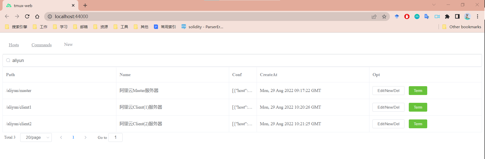
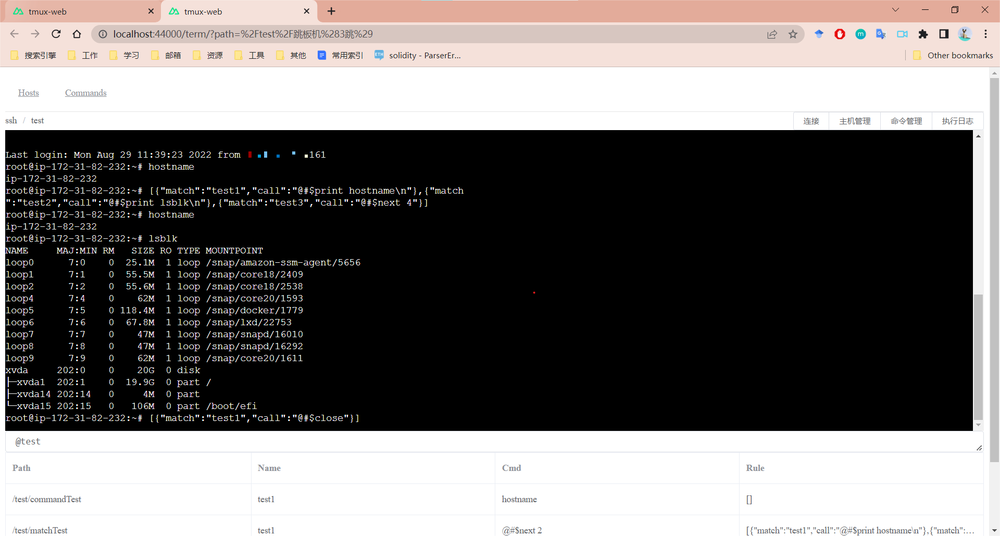
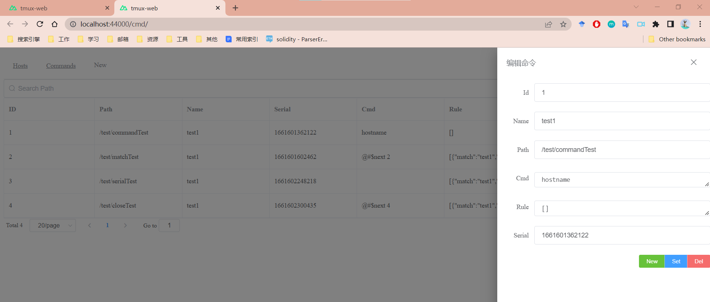
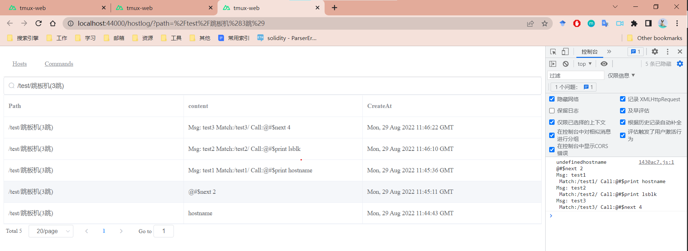
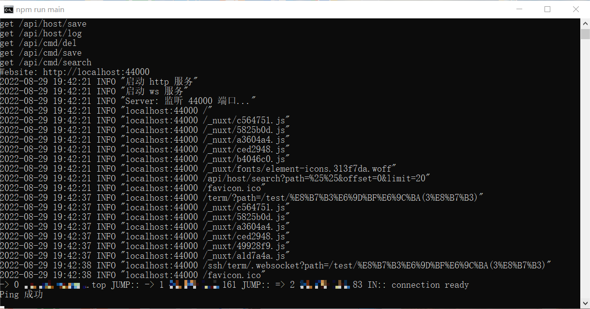

<h1 align="center">SimpleWebSSH</h1>

SimpleWebSSH 是使用 nodejs 实现的一个极简的远程ssh工具，它使用了 express，vue nuxt 前后端分离的实现方式，代码结构简单易懂，并且实现了 主机管理，跳板机，命令日志，命令管理，命令自动化等功能，并且为了简单，并没有实现权限管理，认证，密码、密钥加密替换等功能，实际上仅仅作为一个粗糙的web ssh 演示与参考实现demo，您可以自由地进行fork与扩展。

---
## 特性

- **主机管理**: 主机命令在线批量执行
- **跳板机**: 主机支持浏览器在线终端登录
- **命令日志**: 主机文件在线上传下载
- **命令管理**: 灵活的在线任务计划
- **命令自动化**: 支持自定义发布部署流程
---
## 环境
* Node 16
---
## 安装
linux
``` shell
cd backend
// cp devops-template.db devops.db
npm install
npm run dev
```
浏览器访问 http://localhost:44000

windows 同理, 可给 bin/start.bat 创建一个桌面快捷方式一键打开

本demo使用sqlite存储数据，若需要修改成mysql，只需将exesql的import路径修改为utils/mysql,对应的初始化sql语句与配置在config文件夹中

## 使用
* host配置页面

在host与cmd页面搜索时，为path的模糊匹配，输入回车开始筛选搜索。

在term界面，输入框可以输入搜索命令、保留命令、普通消息字符串，输入 ```@[search]``` 进行搜索命令，点击搜索结果即可变成相应命令，输入```@[key] [params]```保留命令
，系统会匹配并以对应规则处理消息，输入普通消息字符串将直接发送给ssh终端，同时，输入框还支持控制字符，如 ``` ctrl + [方向键|backspace]```，输入```ctrl + [enter]```发送命令。

* ssh配置页面

ssh进行配置时为一个数组，里面为依次跳转的host，最后一个host为最终跳入的ssh
``` json
[
    {"host":"domain.com","port":22,"username":"root","password":"password"},
    {"host":"ip.address","port":22,"username":"root","privateKey":"rsaKey"}
]
```
* cmd配置页面
cmd进行配置时为一个数组，里面为此次处理需要的一组match(顺序，类似if-else if匹配，可多次匹配直到进入下一组规则)的几个规则（支持正则），使用正则需要注意防止自动化过程进入死循环

``` json
[
    {"match":"test1","call":"@#$print hostname\n"},
    {"match":"test2","call":"@#$print lsblk\n"},
    {"match":"reg|test1|[0-9]+","call":"@#$next 4"}
]
```
* cmd保留命令
``` c
// 输出 msg 到 ssh 终端
@#$print [msg]
// 进入命令匹配规则
@#$next [id]
// 关闭 socket
@#$close
```
---
## 预览

### 主机管理


#### 在线终端


#### 命令管理


#### 命令日志


### 后台日志


---

## License & Copyright [MIT](https://opensource.org/licenses/MIT)

---